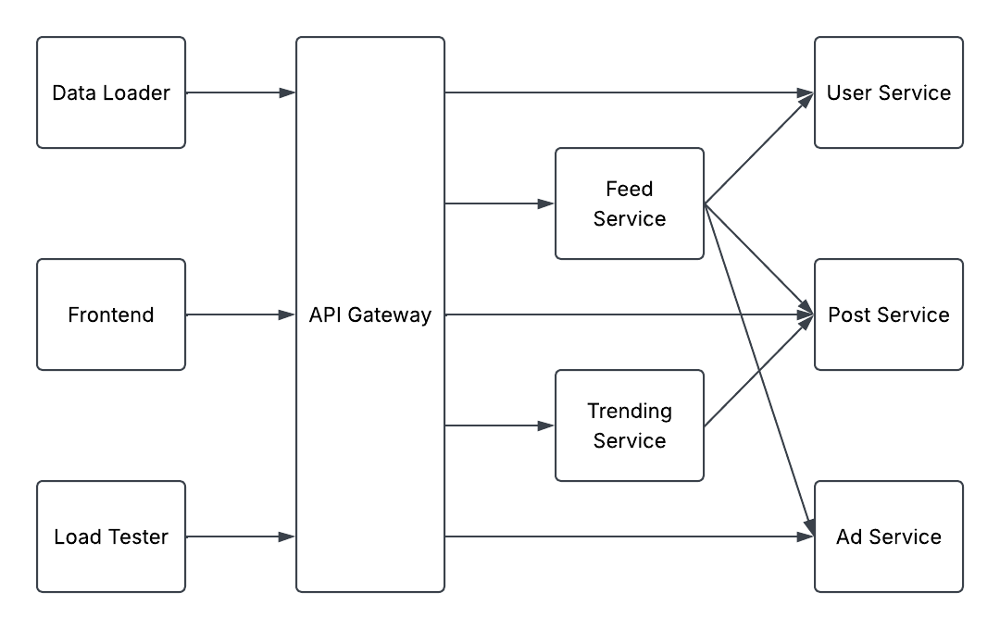
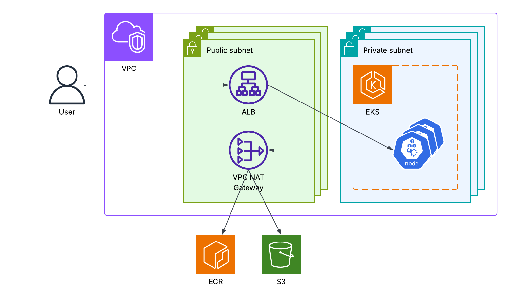

# Duck Social

A social network for ducks built with microservices to learn Kubernetes, inspired by [Google Cloud Platform's microservices-demo](https://github.com/googlecloudplatform/microservices-demo). The project focuses on implementing deployments strategies, scalability, and observability in Kubernetes on AWS.

## Components

The application is split into several microservices that communicate over HTTP. Each service uses a different language and framework.

| Component        | Technology                      | Description                                   |
| ---------------- | ------------------------------- | --------------------------------------------- |
| Frontend         | JavaScript / HTML / CSS + Nginx | Provides the web interface for the app.       |
| Data Loader      | Python                          | Loads sample data into the app.               |
| Load Tester      | Python + Locust                 | Generates application traffic.                |
| Feed Service     | Rust + Axum                     | Aggregates posts, users, and ads into a feed. |
| Trending Service | OCaml + Dream                   | Calculates trending hashtags.                 |
| User Service     | Go + Gin                        | Stores and serves profiles and follows.       |
| Post Service     | Ruby + Sinatra                  | Stores and serves posts.                      |
| Ad Service       | C# + ASP.NET Core               | Stores and serves ads.                        |

## Architecture

Infrastructure is provisioned with Terraform and deployed to Kubernetes using Helm.

## Observability

Application metrics, centralized logging, and dashboards are planned.

## Limitations

This is a personal learning project and is not intended to be production-ready or used as a reference implementation.

- Application data is stored in memory and is lost when pods restart.
- Authentication and authorization are not implemented.
- Contributions and feature requests are not being accepted.
